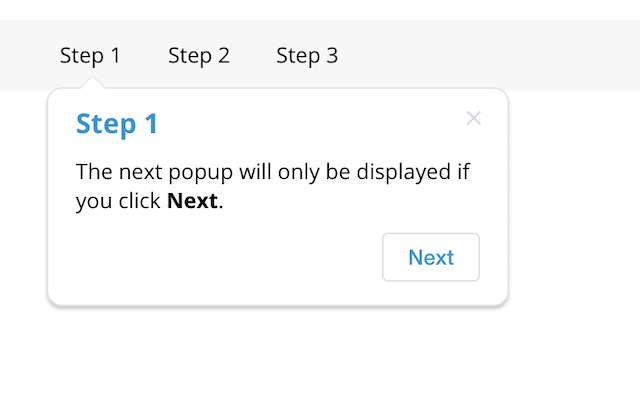

# Material walk-through library

An Angular Material library for displaying walk-through pop-ups and
dialogs using a declarative way.

by Amir Leshem (Broadcom)

### [Show Demo](https://stackblitz.com/edit/angular-bdc-walkthrough)



## Prerequisites

This library is compatible with Angular/Material 8.0 and higher.<br>
Please install the version of bdc-walkthrough according to this table:

| version |   Angular   |  Material   |
|---------|:-----------:|:-----------:|
| 1.2.x   | 14.0 - 15.0 | 14.0 - 15.0 |
| 1.1.1   | 8.0 - 13.0  | 8.0 - 13.0  |

Important Note: When using Material 15.x this library will use the new MDC-based Angular Material Components.
This might lead to inconsistent style usage if the rest of your app is using the legacy (non-MDC) componenets.
For more info please check https://material.angular.io/guide/mdc-migration

1. Install Angular Material:
    ```
    ng add @angular/material
    ```

2. Install bdc-walkthrough:
    ```angular2html
    npm install bdc-walkthrough
    ```

3. Import BdcWalkModule into app.module.ts

## How to use it?
The walk-through library is composed of these parts:

### BdcWalkService
A service used to manage and store the completed tasks.
These are stored in the LocalStorage of the browser.

Each task is either completed (true), uncompleted (false), or completed
with a value (any primitive or object).

Whenever the state of a task is changed, all walk-through popups and dialogs on
page are re-evaluated to appear or disappear according to their
`[mustCompleted]` logic.

> Using the service is completely optional. You only need it to programmatically
> access the state of tasks or if you want to develop new components
> other than the available &lt;bdc-walk-popup&gt; and &lt;bdc-walk-dialog&gt;.

```typescript
export class AppComponent implements OnInit {

  constructor(private bdcWalkService: BdcWalkService) {}

  ngOnInit() {
    // make sure to unsubscribe on ngDestroy
    this.bdcWalkService.changes.subscribe(() => {
        // get the value of a task
        const taskCompleted = this.bdcWalkService.getTaskCompleted('taskCreateApp');
    });
  }

  submit(appForm) {
    // set the value of a task
    const app = DB.createApp(appForm);
    this.bdcWalkService.setTaskCompleted('taskCreateApp', {id: app.id, name: app.name});
  }

  reset() {
    // reset all tasks
    this.bdcWalkService.reset();
  }
}
```
### &lt;bdc-walk-popup&gt;
A component used to display popups automatically when a set of tasks match
the `[mustCompleted]` criteria.

Each popup has a unique name, which is used to identify its task.

If the popup is closed by the user, its task is automatically marked as
completed and it won't show up again.

```angular2html
<bdc-walk-popup #taskDeleteApp name="taskDeleteApp"
  [mustCompleted]="{taskCreateApp: true}">
  Click to delete the App
</bdc-walk-popup>
```

It can then be attached to an element or a component using `[bdcWalkTriggerFor]`
directive and the hashtag reference of the popup:

```angular2html
<button [bdcWalkTriggerFor]="taskDeleteApp" (click)="delete()">
  Delete
</button>
```

You can also manually control which tasks to set when the popup is closed or
its button is clicked using `[onButtonCompleteTask]` and `[onCloseCompleteTask]`.

```angular2html
<bdc-walk-popup #step1 name="step1" [showButton]="true" buttonText="Next" [onButtonCompleteTask]="{next: 1}">
  The next popup will only be displayed if you click <b>Next</b>.
</bdc-walk-popup>

<bdc-walk-popup #step2 name="step2" [showButton]="true" buttonText="Next" [mustCompleted]="{next: 1}" [onButtonCompleteTask]="{next: 2}">
  The next popup will only be displayed if you click <b>Next</b>.
</bdc-walk-popup>
```

Remember a task value can also be an object, not just a primitive.

A task with a value can be evaluated both by its value or simply against `true`
(a task with a value considered to be completed).
You can also compare values that are not equal (!3), smaller (<3) or bigger (>3) than the
specified value using [mustCompleted]="{next: '>2'}".

You can also display a value of a task in a template using `getValue()` on the
template reference.

```angular2html
<bdc-walk-popup #taskCreateApp name="taskCreateApp"
  [onCloseCompleteTask]="{taskCreateApp: {id: 1, name: 'amazing app'}}">
  Click to create the App
</bdc-walk-popup>

<bdc-walk-popup #taskDeleteApp name="taskDeleteApp"
  [mustCompleted]="{taskCreateApp: true}">
  Click to delete the App {{taskDeleteApp.getValue('taskCreateApp').name }}
</bdc-walk-popup>
```

> You can also evaluate only part of an object.
> For instance use `[mustCompleted]="{taskCreateApp: {id: 1}}"` to
> evaluating only the id property of taskCreateApp but ignoring the name.

A popup can be conditionally enabled by evaluating an expression (similar to *ngIf).
This is done by the `[enabled]` input on the `bdcWalkTriggerFor` directive.

In this case we evaluate the Angular's routerLinkActive directive to determine
if the current page is the same as the router link of a navigation bar. In case
it's not, we'll display a popup that asks the user to click on the link.

```angular2html
<div [bdcWalkTriggerFor]="taskNavSites" [enabled]="!linkSiteActive.isActive">
  <a routerLinkActive="active" routerLink="/sites" #linkSiteActive="routerLinkActive">Sites</a>
</div>

<bdc-walk-popup #taskNavSites name="taskNavSites">
  Click to navigate to Sites
</bdc-walk-popup>
```

#### Prioritizing popups
More than one popup can simultaneously appear on the screen. But sometimes despite
the conditions and logic of `[mustCompleted]` you still need to prioritize and
display only one popup. You can use `[mustNotDisplaying]` to prevent a
popup from displaying if others are displayed at the same time.

For instance, when you display a list of sites and want the user to click on the site he
just created.
But in case the site is not in the list (maybe on another page?) you want to
suggest the user to search for it.

It's more declarative to prevent the search suggestion
popup from displaying in case taskClickSite popup appears, rather than
writing code that will check if the created site ID is found in the sites array.

```angular2html
<input [bdcWalkTriggerFor]="taskSearchCreatedSite" (change)="search($event.value)">

<div *ngFor="let site of sites" [bdcWalkTriggerFor]="taskClickSite" [mustCompleted]="{taskCreateSite: {id: site.id}}">
  {{ site.name }}
</div>

<bdc-walk-popup #taskSearchCreatedSite name="taskSearchCreatedSite" header="Search Sites" [mustCompleted]="{taskCreateSite: true}" [mustNotDisplaying]="['taskClickSite']">
  Try searching the Site you just created.<br>
  Type <b>{{ taskSearchCreatedSite.getValue('taskCreateSite').name }}</b> in the search box.
</bdc-walk-popup>

<bdc-walk-popup #taskClickSite name="taskClickSite" header="Click me">
  Click this site
</bdc-walk-popup>
```

#### Popup visualization options
There are some input properties that let you customize the popup visualization:

* `header` set the title of the popup.
* `xPosition` set either the popup is positioned `before` (default) or `after` the triggered element.
* `yPosition` set either the popup is positioned `below` (default) or `above` the triggered element.
* `horizontal` set either the popup is positioned horizontally or vertically (default).
* `arrow` set either an arrow is displayed (default) or not.
* `offsetX` set an offset on the x-axis relative to the trigger element.
* `offsetY` set an offset on the y-axis relative to the trigger element.
* `alignCenter` set either to align the popup's arrow to the center of the element. Default (undefined) align center to small elements only.
* `showCloseButton` set either to display the popup close button (default: true).
* `showButton` set either to display the "Got it" button on a popup (default: false).
* `buttonText` set the text on the "Got it" button (default: Got it).
* `sideNoteText` set the text for the side note near the button.
* `class` set a css class to apply to the popup.

#### Other popup behaviours:

* `name` set the task name for the popup. It's automatically marked as completed when the user close the popup and the popup will never display if the task is completed.
* `closeOnClick` set either to close the popup (and mark it complete) when the user clicks on the triggered element (default: false).
* `mustCompleted` set a dictionary object of tasks to evaluate. Completed task values can evaluate against a partial object value or just true.
* `mustNotDisplaying` set a list of popup names that must not simultaneously appear on the screen in order to display the popup.
* `onCloseCompleteTask` set a dictionary object of tasks to set when the user closes the popup.
* `onButtonCompleteTask` set a dictionary object of tasks to set when the user clicks the "Got it" button of the popup.
* `opened` event emitted when the popup appears. There is not a known reason why you should use it unless for debugging.
* `closed` event emitted when the popup disappears (either by user or task evaluation). There is not a known reason why you should use it unless for debugging.

Methods:
* `getValue(taskName: string)` returns the value of a task.

### [bdcWalkTriggerFor]:

A directive used on any element or component to attach it to a popup instance.
When the popup is displayed it will be positioned relative to that element
(also called the trigger element) and according to the popup behaviours.

In case more than one trigger is attached to the same popup instance
(like in *ngFor), only the first evaluated one will display the popup.

See examples of &lt;bdc-walk-popup&gt; above.

#### Behaviours:
* `bdcWalkTriggerFor` set a reference to the popup instance using a hashtag template variable.
* `enabled` set a boolean expression to determine if the popup should be enabled (default: true).
* `mustCompleted` set a dictionary object of tasks to evaluate. Completed task values can evaluate against a partial object value or just true. This is exactly the same as defining `mustCompleted` on the popup instance but is useful for cases you iterate on a list with *ngFor and need to compare from values of the iteration.
* `data` set a context object that the popup instance template can then consume using `<ng-template let-value>`.

### &lt;bdc-walk-dialog&gt;
A component used to display dialogs automatically when a set of tasks match
the `[mustCompleted]` criteria.

```angular2html
<bdc-walk-dialog #dialogFinish name="dialogFinish" width="650px"
                 [mustCompleted]="{taskCreateApp: true, taskDeleteApp: true}">

  <h1>Finished!</h1>
  Hurray,<br>
  You've successfully finished the tutorial.

  <div class="buttons">
    <button (click)="dialogFinish.close()" mat-raised-button color="primary">Close</button>
  </div>
</bdc-walk-dialog>
```

Dialog behaviours:
* `name` set the task name for the dialog. The dialog will never display (or will just close) if the task is completed.
* `width` set the width of the dialog (default: 500px).
* `mustCompleted` set a dictionary object of tasks to evaluate. Completed task values can evaluate against a partial object value or just true.
* `mustNotDisplaying` set a list of popup/dialog names that must not simultaneously appear on the screen in order to display the dialog.
* `opened` event emitted when the dialog appears. There is not a known reason why you should use it unless for debugging.
* `closed` event emitted when the dialog disappears (either by user or task evaluation). There is not a known reason why you should use it unless for debugging.

Methods:
* `getValue(taskName: string)` returns the value of a task.
* `close(setTasks?: { [taskName: string]: any | boolean })` closes the dialog by completing its task, and optionally set additional tasks.

## Building source code and running the demo
Download the source code from github https://github.com/Broadcom/bdc-walkthrough.
Then run `npm i` to install dependencies, `npm run build:lib` to build the bdc-walkthrough library, and finally `npm run start` to run the demo.
